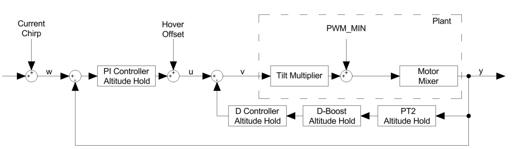

# Altitude Hold Controller

The Altitude Hold control loop maintains a constant altitude by adjusting the throttle based on the measured vertical position. The altitude estimation is mainly based on GPS measurements fused with IMU sensor data to estimate the current vertical position and motion of the drone.

During the development of the tuning tool, major changes were made to the Betaflight firmware affecting the Altitude Hold functionality and control loop. Therefore, only a proof of concept based on the firmware version from February 2026 was implemented. As a result, the modified firmware will not be merged into the Betaflight codebase and the tuning tool will not be implemented in Python for community use.

This section presents the firmware modifications required for applying the tuning method to the Altitude Hold controller. It also describes the control loop calculation and the tuning process, including the evaluation of the step response and the Gang of Four. Furthermore, the section is intended to support future developers once the ongoing firmware changes are completed and the Altitude Hold controller has stabilised.

## Altitude Hold Control Loop

In the Altitude Hold mode, an additional control loop gets activated. It controls the thrust part of the motors as described in the motor mixing chapter. Therefore, the drone is able to fly at a constant altitude without the pilot having to adjust the throttle stick. The Altitude Hold control loop is not cascaded, as shown in the figure below.

**Figure:** Control structure of the Betaflight Altitude Hold controller.

The figure shows the complete altitude control loop in the Altitude Hold mode. The reference input $w$ is mostly zero, since the controller regulates the deviation from the captured hover altitude rather than an absolute altitude. This error signal is fed into a PI controller, which generates the main control action.

The output of the PI controller is then combined with a feedback signal containing the D-term. This feedback signal compensates the I-term, which stops the drone from overshooting the target altitude. The resulting signal is then fed into the plant, which consists of the drone dynamics, the motors and the tilt multiplier.

The tilt multiplier is a factor that scales the thrust based on the current tilt angle of the drone. This is necessary because the vertical component of the thrust decreases as the drone tilts and the control loop needs to compensate for this effect to maintain a stable altitude.

In the feedback path which includes the D-term, a D-Boost is implemented. During normal Altitude Hold operation, a rather small D-term is preferred in order to avoid unnecessary noise amplification and throttle oscillations while maintaining a constant altitude. During fast vertical movements of the drone, however, the D-Boost increases the D-term gain dynamically. This helps to improve the damping and transient behaviour of the Altitude Hold control loop, especially during rapid altitude changes.

The D-Boost is calculated based on the estimated vertical velocity. For the measurements performed in this work, the D-Boost was disabled in order to obtain a system behaviour which is as linear as possible for the frequency-domain system identification.

## Firmware Modifications

The Betaflight fork used in this work is based on the upstream master branch from February 2026, commit `04e37a122`. All modifications are protected by the compile-time flag `USE_ALTHOLD_CHIRP`, ensuring that a build without this flag behaves identically to the upstream version. The implementation consists of a dedicated flight mode, an extension of the chirp generator, modifications to the altitude controller, additional debug outputs and several user-configurable parameters.

A new flight mode called `ALTHOLD_CHIRP` was introduced to enable chirp-based system identification in Altitude Hold mode. The corresponding mode was added in `rc_modes.c`, `rc_modes.h` and `runtime_config.h`. The mode can be activated via an RC switch and is only enabled when Altitude Hold is active. For safety reasons, the excitation is automatically disabled during failsafe or GPS rescue.

The chirp signal generation was implemented in `common/chirp.c`. While the original Betaflight chirp generator was designed for angular rate excitation, Altitude Hold requires a position-based excitation signal. Therefore, a new function called `altChirpUpdate` was added, which reuses the existing logarithmic frequency sweep but generates a direct sine signal suitable for altitude control.

The chirp is injected into the altitude setpoint within `altHoldUpdate` in `alt_hold_multirotor.c`. When the mode is activated, the current target altitude is stored as a reference value. The chirp signal is then added to this reference, causing the altitude setpoint to oscillate symmetrically around the hover point. When the mode is disabled, the generator is reset to ensure reproducible measurements.

To improve the quality of the frequency-response estimation, two nonlinear controller elements were temporarily disabled during the chirp excitation in `altitudeControl` within `autopilot_multirotor.c`. These are the I-term-relax scaling and the velocity-dependent D-Boost term. Disabling both features helps to maintain approximately linear controller behaviour during the measurement and improves the accuracy of the identified transfer function.

A new debug mode called `DEBUG_ALTHOLD_CHIRP` was added to expose all signals required for the offline analysis. The recorded signals include the chirp input, altitude, altitude setpoint, PID controller outputs, vertical velocity and throttle command. These signals are logged through the existing Blackbox infrastructure and form the basis for the frequency-domain identification process.

Additional feedback was provided to the pilot through the on-screen display. A dedicated flight-mode indicator shows when the chirp mode is active, while a warning message informs the user when the frequency sweep has been completed.

Finally, four new CLI parameters were added to configure the chirp amplitude, start frequency, end frequency and sweep duration. These parameters allow the excitation signal to be adapted to different vehicles and measurement scenarios without modifying the source code.
