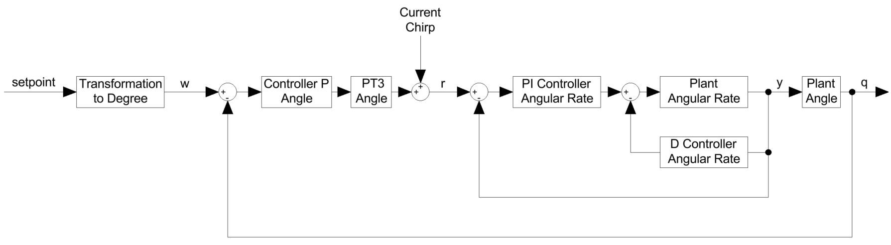
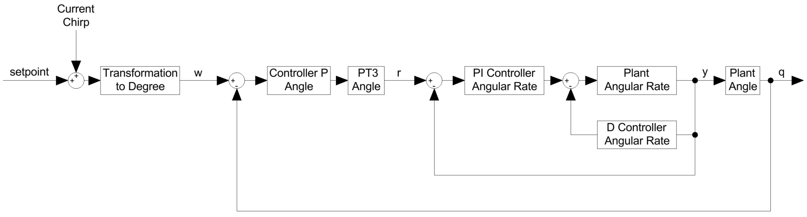

# Angle Mode Control Loop

In Angle mode, the angular rate controller is extended by an additional outer angle control loop, resulting in a cascaded control structure. Unlike Acro mode, the pilot stick input no longer directly defines an angular rate, but instead a target angle for the drone orientation.

The outer angle loop operates at a slower dynamic compared to the inner rate loop. Its task is to generate stable angular rate setpoints that move the drone towards the desired orientation. The inner angular rate controller then reacts much faster and stabilises the rotational motion of the quadcopter.

The cascaded architecture separates attitude control from angular rate stabilisation. While the outer loop drives the drone towards the desired orientation, the inner loop provides fast stabilisation by regulating the angular velocity. The pilot therefore commands an angle rather than a rotational rate.

In contrast to Acro mode, the drone automatically returns to the commanded orientation when the stick input is centred.

The Angle mode controller therefore consists of two cascaded loops:

- The outer angle loop, which computes the angle error.
- The inner angular rate loop, which computes the rate error.

**Figure:** Cascaded control structure of the Betaflight Angle mode controller.

The angle control loop consists of a proportional controller and an additional feedforward term. While the feedforward improves responsiveness during normal flight operation by directly reacting to stick inputs, it complicates offline system identification because part of the controller output no longer originates from the feedback loop.

To simplify transfer function estimation and controller tuning, the feedforward term is disabled in the modified firmware. This allows the angle control loop to be analysed as a purely proportional controller.

## Firmware Modifications

The chirp generator described in the gyro-controller tuning section is reused here. Its public interface, `chirpInit` and `chirpUpdate` in `src/main/common/chirp.c`, and the invocation of `chirpInit` inside `pidInit` in `src/main/flight/pid_init.c` are unchanged. The configured frequency range, sweep time and per-axis amplitudes are reused from the gyro-tuning configuration.

Injecting the chirp at the same point as in the gyro case would, however, leave the excitation inside the closed angle loop. The inner-loop rate setpoint would be driven simultaneously by the angle controller's output and by the chirp itself. Therefore, the transfer function from the angle target to the measured angle could not be recovered from the resulting logs directly. The relevant existing structure is shown in the Angle Mode Control Loop figure.

To make this transfer function identifiable, a small modification was made to `pidController` in `src/main/flight/pid.c`. While `CHIRP_MODE` is engaged and the affected axis is in Angle mode, the chirp value is injected upstream of `pidLevel`, before the rate-to-angle transformation, rather than at the inner-loop rate setpoint.

Inside `pidLevel`, the rate-domain setpoint is converted into a target angle via a linear transformation scaled by the configured tilt-angle limit divided by the maximum commanded rate. Because this transformation is linear, the `chirp_amplitude_*` values calibrated for rate-loop excitation map proportionally onto the angle-target excitation and carry over without re-tuning. The resulting modified structure is shown below.

**Figure:** Modified control structure used for angle-controller tuning. The chirp signal is injected before the rate-to-angle transformation, allowing direct identification of the transfer function between the target angle and the measured angle.

The excitation signal is selected depending on the corresponding `levelMode` state. In Angle mode, a sine-shaped chirp is used so that the target angle oscillates around the current angle setpoint. In Acro mode, the existing gyro-tuning behaviour is retained, including the low-frequency amplitude taper below 1 Hz. This prevents excessive angle excursions caused by the integrating behaviour of the rate loop.

To improve the signal-to-noise ratio, a new parameter called `chirp_repeat` was added. This allows the same chirp sweep to be repeated multiple times before the sequencer advances to the next axis. A settling time of 750 ms is inserted between repetitions. The parameter is limited to a maximum value of 9 so that the repeat counter can still be displayed in the OSD.

A lag filter is applied to the chirp signal before injection. This filtering is already part of the upstream implementation and is configured through the `chirp_lag_freq_hz` and `chirp_lead_freq_hz` parameters. The only change made here is a `phaseCompReset` function, added as a precaution to clear the filter state and prevent transients from a previous measurement from carrying over. The reset is triggered whenever `CHIRP_MODE` is activated, a new axis is selected or a new repetition starts.

The internal signals required for the offline tuning tool are recorded through the existing `DEBUG_CHIRP` channels. Besides the chirp phase, active axis, instantaneous frequency and excitation signal, the target and measured angle are also logged. These values are stored by the existing Blackbox system when `debug_mode` is set to `CHIRP`, requiring no modifications to the Blackbox implementation itself.

All functionality described in this section is only included when the firmware is compiled with `USE_CHIRP`. Without this option, the firmware remains functionally equivalent to the upstream baseline.
