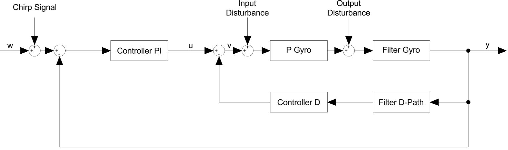

# Acro Mode Control Loop

In Acro mode, the control loop is designed to directly regulate the angular rates of the drone. The reference input to the controller is the desired angular rate, which is derived from the pilot's stick inputs. The controller generates the required motor commands to achieve the desired angular rates.

The chirp signal is added to the reference input, allowing the excitation of the system over a wide frequency range. This enables the estimation of the transfer functions of the gyro control loop components.

The control loop in Acro mode can be represented as follows:

**Figure:** Control loop structure in Acro mode showing the chirp signal injection, the PI and D controller branches, the real drone dynamics (*P Gyro*), the gyro filter and the disturbance inputs used for system identification and frequency-response analysis.

The figure shows the complete gyro control loop in Acro mode. The reference input $w$, which represents the desired angular rate, is combined with a chirp signal to excite the system over a wide frequency range. The resulting signal is fed into a PI controller, which generates the main control action.

After the controller, input disturbances are added before the signal enters the plant $P_{\text{Gyro}}$, representing the real drone dynamics. Output disturbances are introduced after the plant and before the gyro filtering stage. The measured angular rate $y$ is then fed back to the controller.

A key feature of this control structure is the placement of the D-controller in the feedback path instead of the forward path. The D-controller acts on the measured output signal and is fed back negatively. This configuration is used to compensate for a zero in the plant dynamics, improving the system stability while reducing the noise amplification that would occur if the derivative term were applied directly to the reference signal.

Additionally, dedicated filters are used to attenuate high-frequency noise before it affects the control action. This is especially important for the D-controller, since the derivative term is generally very sensitive to noise. Without the D-path filter, measurement noise would strongly affect the D-term and therefore the controller output, which is not desired and could lead to unstable behaviour.
