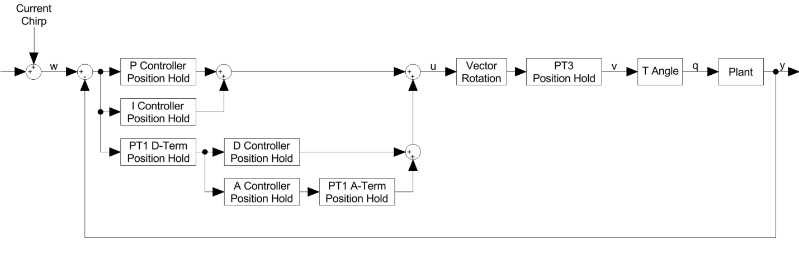
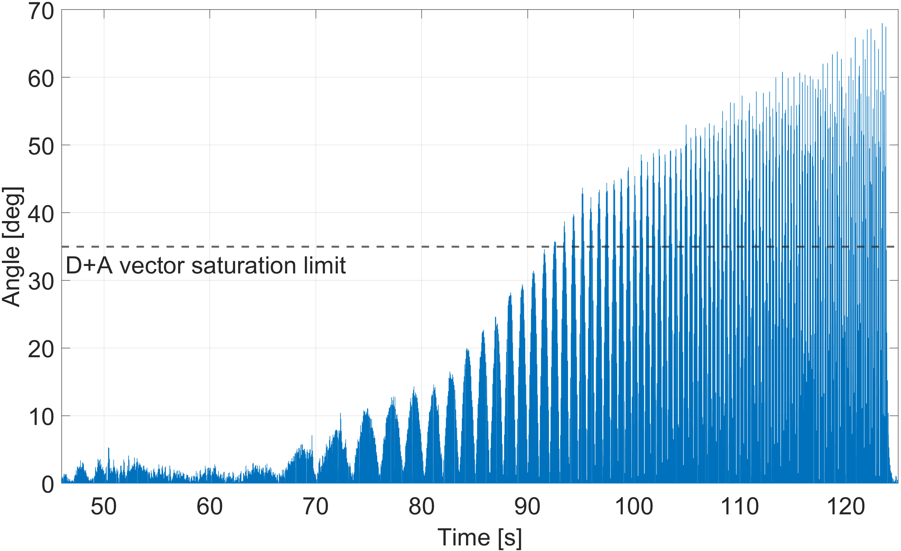
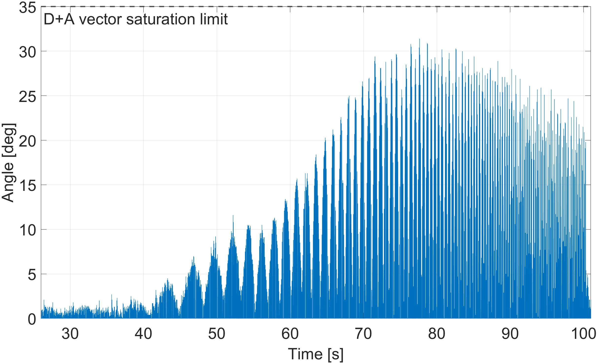

# Position Hold Control Loop

The Position Hold controller represents the outermost control layer in the flight control architecture. Its objective is to maintain the drone at a desired geographic location by continuously evaluating the position error and generating corrective attitude commands. These commands are forwarded to the existing angle controller, resulting in a cascaded control structure.

**Figure:** Control structure of the Betaflight Position Hold controller.

The figure illustrates the signal flow of the Position Hold controller. The control loop begins with the GPS position estimate, which is compared with the target hold position to generate position errors in the North-East plane. Based on these errors, the controller calculates corrective commands using proportional, integral, derivative and acceleration feedback terms.

For each axis, the controller output is given by

$$
u_{\text{axis}}
=
K_p d_{\text{axis}}
+
K_i \int d_{\text{axis}} dt
+
K_d \dot d_{\text{axis}}
+
K_a \ddot d_{\text{axis}}
$$

where $d_{\text{axis}}$ denotes the position error. The velocity term is estimated from successive position measurements, while the acceleration term is obtained by differentiating the velocity estimate. Since GPS measurements are inherently noisy, both signals are filtered before being used by the controller.

The controller calculations are performed in the Earth-Fixed frame, where the position errors are expressed in the North-East directions. However, the inner angle controller requires roll and pitch commands in the body frame. Therefore, the resulting control vector is rotated according to the current yaw angle before being passed to the inner control loop.

The resulting body-frame commands are then used as attitude references for the angle controller, which generates the corresponding angular rate commands for the underlying rate controller.

## Betaflight Firmware

While the previous section described the general control structure, the Betaflight firmware introduces several implementation-specific features to improve stability, robustness and GPS-based position tracking performance.

Unlike the inner attitude controller, which operates at a fixed update rate of 100 Hz, the Position Hold controller is executed asynchronously and runs only when new GPS data becomes available.

To improve both position capture and stationary hovering performance, the controller operates in two distinct phases: the **stopping phase** and the **holding phase**.

The stopping phase is activated whenever the pilot deflects the control sticks while Position Hold is enabled. During this phase, only the proportional, derivative and acceleration terms contribute to the control output, while accumulation of the integral term is suppressed. Any previously accumulated integral contribution is gradually leaked away to prevent windup when the drone is brought back to the target position. To improve braking performance, the derivative contribution is multiplied by a factor of 1.6.

The controller continuously monitors both the raw velocity estimate and its filtered counterpart. When their signs differ, indicating a reversal of motion, the drone is considered stopped on that axis and the controller transitions into the holding phase. During initialisation, the controller always enters the stopping phase first. However, if the control sticks remain centred, the transition into the holding phase occurs immediately and the derivative boost is never applied.

During the holding phase, all four feedback terms contribute to the control output. The integral term becomes active and accumulates position error over time, allowing steady-state position errors to be eliminated.

To reduce GPS-induced measurement noise, the velocity estimate is filtered using an adaptive first-order PT1 low-pass filter whose cutoff frequency depends on the current GPS update interval. The acceleration estimate is obtained by differentiating the filtered velocity signal and applying a second adaptive PT1 filter.

Before the generated attitude commands are forwarded to the inner control loop, several safety limits are applied. First, the combined derivative and acceleration contribution is limited to a maximum magnitude of $35^\circ$. This prevents excessively aggressive corrections during rapid position changes or when Position Hold is activated at higher speeds. If the limit is exceeded, the vector is scaled proportionally:

$$
\text{if} \quad |\vec{u}_{\text{DA}}| > 35^\circ, \quad
\vec{u}_{\text{DA}} \leftarrow \vec{u}_{\text{DA}}
\cdot
\frac{35^\circ}{|\vec{u}_{\text{DA}}|}
$$

After the proportional and integral contributions have been added, the complete PIDA command vector is constrained to the configurable maximum tilt angle:

$$
\text{if} \quad |\vec{u}_{\text{PIDA}}| > \theta_{\max}, \quad
\vec{u}_{\text{PIDA}} \leftarrow \vec{u}_{\text{PIDA}}
\cdot
\frac{\theta_{\max}}{|\vec{u}_{\text{PIDA}}|}
$$

Since the Position Hold controller operates only at the GPS update rate, typically below 10 Hz, while the inner angle controller runs at 100 Hz, a PT3 upsampling filter is used to interpolate the generated attitude commands to the higher controller rate. This provides smooth attitude references for the inner angle controller despite the low GPS update rate.

Finally, a sanity check continuously monitors the distance between the drone and the target position. The allowable distance is scaled dynamically with ground speed and corresponds to twice the distance the drone would travel within two seconds, with a minimum threshold of 10 metres. If this limit is exceeded, indicating a GPS anomaly or loss of position control, Position Hold is automatically disengaged and control is returned to the pilot.

## Firmware Modifications

To evaluate and tune the Position Hold controller, an exponential chirp signal is injected directly into the position error during flight. By sweeping through a predefined frequency range, the position controller is forced into a controlled response, allowing its frequency-dependent behaviour to be measured.

As mentioned in the Betaflight Firmware section, the magnitude of the D+A vector is limited to 35 degrees. For system identification, this limitation introduces nonlinear behaviour. To mitigate this, a lead-lag filter is applied to the chirp signal before injection, reducing its amplitudes at higher frequencies. This results in less acceleration of the drone and therefore a smaller combined D+A vector length. The figure below illustrates how the D+A magnitude can easily exceed the 35-degree limit during chirp excitation without the lead-lag filter and how the filter affects the magnitude of the vector.

| Without Lead-Lag filter | With Lead-Lag filter |
|---|---|
|  |  |

**Figure:** Comparison of combined D+A vector magnitude during chirp measurements.

To ensure linear controller operation throughout chirp measurements, the firmware automatically transitions the Position Hold state machine into the holding phase upon chirp alignment. This explicit transition is critical because it keeps the integral term fully active and accumulating, rather than leaking away during manual control transitions, and eliminates the 1.6x derivative boost that would otherwise corrupt the measured frequency response.

Additionally, the control sticks must remain centred throughout the chirp sweep to prevent suppression of the integral term. These constraints ensure that all four feedback terms, P, I, D and A, operate consistently and predictably, allowing the measured drone response to reflect true linear dynamics.

To enable repeatable measurements, an automated heading alignment sequence precedes each chirp sweep. Upon activation, a proportional yaw controller rotates the drone to face true North, corresponding to 0 degrees heading. Once the heading error falls within tolerance, alignment is locked, controller state is reset and the first chirp phase begins on the East-West, or longitude, axis.

At 0-degree heading, this Earth-Fixed axis maps cleanly to the body-frame roll axis. After the first sweep completes, the second chirp excites the North-South, or latitude, axis, corresponding to body-frame pitch. This alignment ensures that Earth-Fixed and body-frame dynamics are directly observable.

The `active_axis` flag controls which axis receives excitation: `0` for longitude, corresponding to East-West and roll, and `1` for latitude, corresponding to North-South and pitch. This enables separate system identification for each axis. Since both axes share identical PID parameters, the controller design is based on the less dynamic axis.

CLI commands were added to configure all chirp parameters including start and end frequencies, sweep duration, amplitude, yaw alignment gains and lead-lag filter frequencies via the Betaflight configurator. New Blackbox debug variables log all required signals for analysis.

## Control Loop Calculation

With the injected chirp signal and the recorded flight data, the frequency response of the Position Hold control loop can be estimated. The estimation follows the procedure described in the theory chapter, including signal preprocessing, filtering and spectral averaging. The resulting transfer function represents the complete closed-loop behaviour of the Position Hold system, including both the controller and the drone dynamics.

The estimated transfer functions provide insight into the dynamic behaviour of the system and allow key characteristics such as bandwidth, phase behaviour and stability margins to be evaluated. These results form the basis for the subsequent tuning and validation process.
