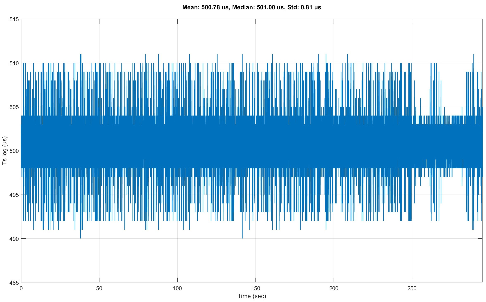

# Timing and Sampling of Blackbox Log Data

## Overview

Betaflight Blackbox logs record flight data on every iteration of the flight control loop using a continuously increasing timestamp in microseconds. This counter represents elapsed time since system boot, not real-world clock time. 

---

**This document describes the analyst perspective**, outlining what must be done when analyzing or decoding Betaflight Blackbox logs. For accurate log analysis, these raw timestamps must be converted into a usable time axis and the actual sampling intervals between log entries must be calculated.

The microsecond format is more efficient for the flight controller hardware and enables high-precision timing without loss of accuracy. All flight data, including PID corrections, RC commands, gyro readings and motor outputs, is correlated to this timestamp.


## What Betaflight Does Internally

Betaflight stores the raw microsecond timestamp directly in each log entry without any time correction or compensation. The blackbox logger uses **delta encoding** for compression efficiency: 

- **I-frames** (Inertial frames): Written every ~32ms, containing full data snapshots with absolute timestamp values. 
- **P-frames** (Predicted frames): Written between I-frames, storing only the differences from expected values.  Time is encoded using `PREDICT(STRAIGHT_LINE)`, meaning Betaflight assumes time increases linearly and only stores the delta from this prediction.
- **S-frames** (Slow frames): Written every ~8 seconds, containing infrequently changing data. 

The logger does not attempt to correct for timing variations, it simply records the actual `currentTimeUs` value at the time of logging. Any timing irregularities (due to SD card latency, CPU load or task scheduling) are preserved in the log.


## Sampling Intervals from the Analyst Perspective

When analyzing logs, you must account for the fact that Blackbox logging does not operate with a guaranteed constant sampling rate. The time intervals between consecutive log entries can vary due to several technical factors:

- **Non-real-time scheduling**: Betaflight is not a hard real-time system. Tasks such as gyro sampling, filtering, PID calculations, motor updates, telemetry and OSD run with different priorities. The Blackbox logger has relatively low priority and may be delayed.

- **SD card write latency**: SD card write operations introduce timing variations because internal flash memory processes require different amounts of time for each write cycle. 

- **System load**: High CPU load from other flight controller tasks can temporarily delay logging.

These variations mean that even when configured for a 1 kHz logging rate, the actual time between samples may fluctuate.

To visualize this effect, the figure below shows actual sampling intervals extracted from a real Betaflight Blackbox log.  You can clearly see the timing jitter around the target interval, as well as occasional larger spikes caused by SD card write latency and task scheduling delays.

<p align="center">
  
  <br>
  <em>Figure 1: Sampling intervals extracted and visualized using the analysis tool in this repository from a Betaflight Blackbox log configured for 2 kHz (500 μs target). The plot shows timing jitter and occasional larger delays caused by SD card writes and task scheduling. Mean: 500.21 μs, Median: 500.00 μs, Standard Deviation: 0.84 μs.</em>
</p>


## Calculating Sampling Intervals

By calculating the time differences between consecutive log entries (Δt), the actual sampling intervals can be determined:

```
Δt[i] = timestamp[i+1] - timestamp[i]
```

These intervals represent the true time base of the recorded data and are essential for numerically correct analysis.


## Analysis Applications

Analyzing these sampling intervals enables several important evaluations:

- **Determine the effective logging rate**  
  Verify whether Betaflight is logging at the intended rate (for example 1 kHz) or if the actual rate deviates. 

- **Detect timing jitter**
  Identify variations in sampling time caused by SD card latency, CPU load or scheduling behavior.

- **Identify timing anomalies**  
  Large gaps in timestamps indicate delays or missing data due to SD card write operations or system load.

- **Enable numerically correct analysis**
  Accurate sampling intervals are essential for correct FFT calculations, filter design, frequency analysis and controller evaluation. These methods rely on the true time base provided by the log.


## References and Sources

**Blackbox Timestamp Format:**
- [Betaflight Official Documentation:  Blackbox flight data recorder](https://www.betaflight.com/docs/development/Blackbox)  
  Documentation of Blackbox logging format and timestamp encoding.

**Blackbox Implementation:**
- [src/main/blackbox/blackbox.c](https://github.com/betaflight/betaflight/blob/7f8e4d5b8af17bee89b482d7f4aa1ad40e772496/src/main/blackbox/blackbox.c#L194-L199)  
  Defines time field encoding with `PREDICT(STRAIGHT_LINE)` for P-frames:  
  ```c
  {"time", -1, UNSIGNED, . Ipredict = PREDICT(0), .Iencode = ENCODING(UNSIGNED_VB), 
   .Ppredict = PREDICT(STRAIGHT_LINE), .Pencode = ENCODING(SIGNED_VB), CONDITION(ALWAYS)}
  ```

- [src/main/blackbox/blackbox. c](https://github.com/betaflight/betaflight/blob/7f8e4d5b8af17bee89b482d7f4aa1ad40e772496/src/main/blackbox/blackbox.c#L333-L359)  
  Defines `blackboxMainState_t` structure including `uint32_t time` field for microsecond timestamp storage.

- [src/main/blackbox/blackbox.c](https://github.com/betaflight/betaflight/blob/7f8e4d5b8af17bee89b482d7f4aa1ad40e772496/src/main/blackbox/blackbox.c#L2297-L2314)  
  Shows blackbox interval calculations: 
  ```c
  // an I-frame is written every 32ms
  blackboxIInterval = (uint16_t)(32 * 1000 / targetPidLooptime);
  blackboxPInterval = 1 << blackboxConfig()->sample_rate;
  blackboxSInterval = blackboxIInterval * 256; // S-frame every ~8 seconds
  ```

### Related Resources

- [Betaflight GitHub Repository](https://github.com/betaflight/betaflight) - Official firmware source code