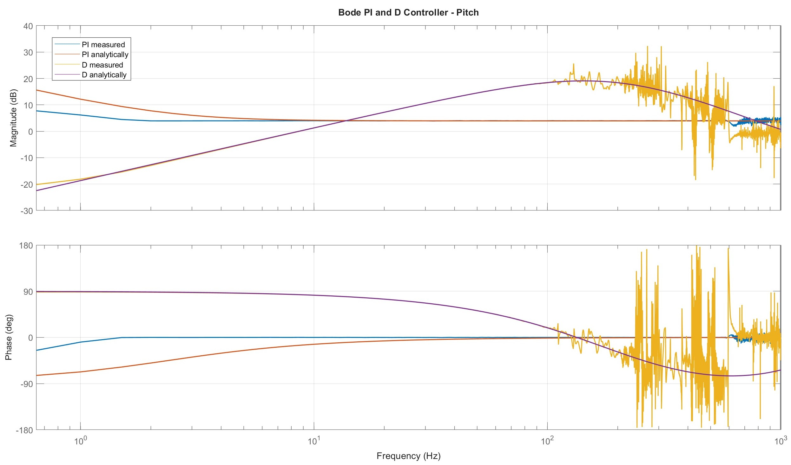

# Bode Plot Controller

This plot is used as an information and verification tool. It allows you to compare the analytically calculated PI and D controllers to the measured ones. It serves as a check of whether the analytically calculated controller matches the real system.

  

The deviation at low frequencies is caused by the I-Term Relax, which intentionally modifies the I-component during fast stick movements. This is not included in the analytical calculation. This results in slight differences at low frequencies between the calculated and measured PI response.

At high frequencies, differences arise mainly from measurement errors such as noise. In this range, the data becomes less accurate, which is completely normal and not relevant for tuning purposes. The most important region is the middle frequency range, where the measured and analytical PI responses should closely match.
