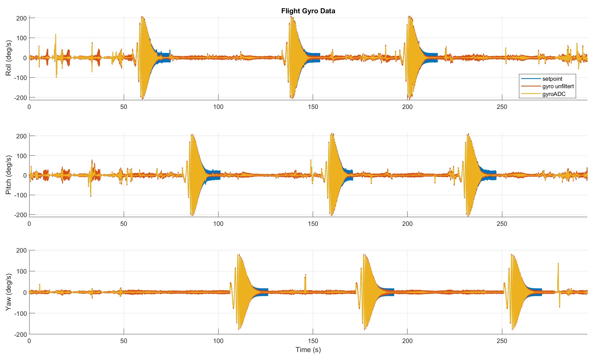

# Flight Gyro Data

This plot gives an overview of the recorded gyro signals for the three axes, roll, pitch and yaw during your flight. You can see the controller setpoints, as well as the unfiltered and filtered gyro signals. This visualizes the differences between the commanded values and the actual sensor data. 

  

By looking at the plot, you can, for example, clearly see the [Chirp Signals](../Sinarg/Chirp.md) in the three axes (frequency sweeps). With this log file, you can later tune your drone's PID controllers.
