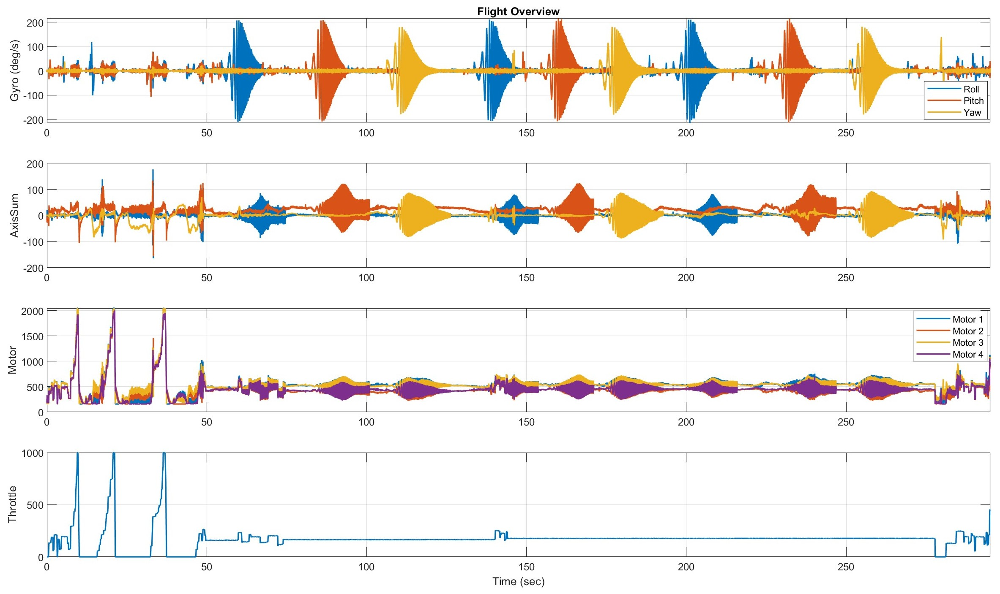

# Flight Overview - Gyro Data

This figure provides an overview of some important signals recorded during the flight.

### Top subplot (Gyro)

The angular rates for roll, pitch and yaw are shown. You can clearly see the chirp patterns, where each axis is driven by a signal that slowly changes its frequency over time. These chirps help reveal how the system reacts to different frequencies.

### Second subplot (AxisSum)

The AxisSum plot gives you an overview of the output of the rate PID controller for roll, pitch and yaw. Each signal represents the total control command generated for one axis by summing all active controller terms (P, I, D and feedforward, if enabled). This signal is later mixed to the individual motors.

AxisSum describes controller effort, not measured motion. Low amplitudes indicate that the aircraft is tracking the setpoint with little correction, while higher amplitudes mean the controller must apply stronger corrective action to compensate for disturbances, tracking errors, or aggressive inputs.

Increases in AxisSum can be observed during fast maneuvers, during excitation sequences, or when vibrations and resonances are present. In such cases, the controller injects more energy into the system in an attempt to maintain stability. Persistent high levels or strong high-frequency content in AxisSum may indicate overly aggressive gains, insufficient filtering, or mechanical issues. 

### Third subplot (Motors):

This plot shows the motor speeds throughout the entire flight. Each motor is plotted separately to allow for comparison between them. The y-axis represents motor speed in revolutions per minute (RPM). Differences between motor traces can indicate control corrections, load changes, or possible imbalances during flight.

### Bottom subplot (Throttle)

This plot shows the throttle stick input throughout the flight. It represents the amount of throttle commanded by the pilot. The throttle signal ranges from 0 to 1000, where 0 corresponds to minimum throttle and 1000 corresponds to 100% throttle.

  

