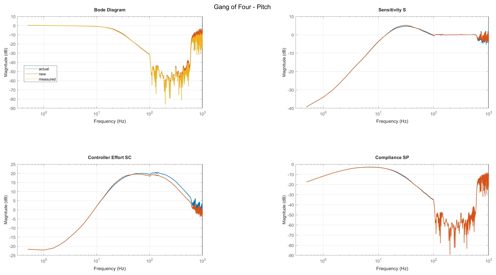
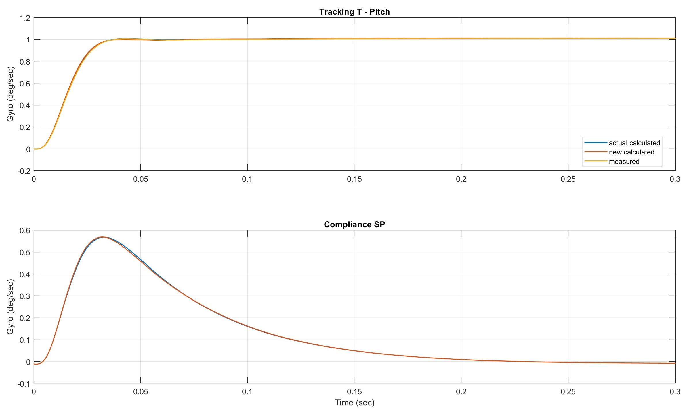
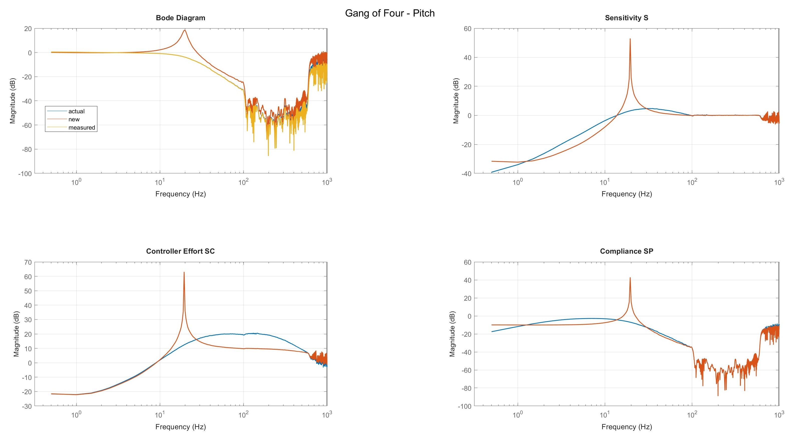
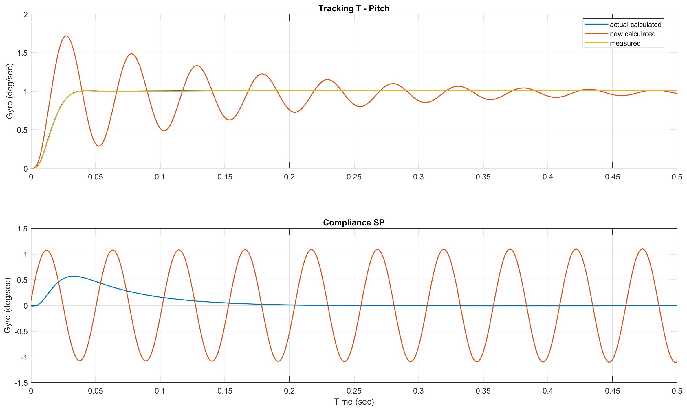

# Gang of Four

The Gang of Four is a standard set of four transfer functions that together fully characterize a feedback control system. In this case, your drone. These plots will help you evaluate stability, tracking performance, disturbance rejection and controller workload. Each plot highlights a different aspect of the system, so it is strongly recommended to use all of them.

  
    Figure 1: Gang of Four plot of a well-tuned drone

The key frequency regions for your drone are:

- **~ 0 – 100 Hz:** Actual flight movements of the drone and pilot commands
- **~ 100 – 600 Hz:** Dominated by vibrations from motors and propellers
- **~ >600 Hz:** Primarily high-frequency sensor and electronic noise

## Bode Diagram (T) – Tracking / Closed Loop Response

This plot shows how well the controller follows the setpoint at different frequencies. At low frequencies, a flat response ensures accurate tracking of pilot commands and stable flight behavior. A smooth roll-off at higher frequencies is essential to prevent the controller from reacting to motor vibrations or sensor noise, maintaining stability and efficiency.

## Sensitivity S – Disturbance Sensitivity & Stability Margin

Sensitivity indicates how strongly the system reacts to external disturbances, such as wind. Low sensitivity in the low-frequency region means the controller effectively suppresses disturbances. At higher frequencies, it's normal and expected for sensitivity to approach 0 dB, since the controller cannot react to such fast disturbances. A small overshoot (peak) in the mid-frequency range is common and usually acceptable if it stays **below 6 dB**.

## Controller Effort SC

This plot shows how much control activity (from P, I and D terms) is generated in each frequency band. Large values, especially in the mid- or high-frequency ranges, can indicate the controller is overreacting to vibrations or noise.

## Compliance SP – Disturbance Transmission / Flexibility

Compliance indicates how much disturbance is transmitted to the system output. Low values in the low-frequency region mean effective rejection of flight disturbances. Peaks in the mid-frequency region point to resonances or weaknesses in vibration handling.

## Summary for Tuning

In general, your sensitivity, controller effort and compliance curves should follow a smooth and rounded shape. This indicates a stable and robust system, which effectively rejects low-frequency disturbances, filters out high-frequency noise and avoids excessive controller activity or sharp peaks that could lead to instability, resonance, or unnecessary workload.

If your Gang of Four plots look like this, your step response will also be smooth and well-behaved, as shown below. It corresponds to the settings applied to the system in Figure 1.

Keep in mind, if you have a **notch filter** enabled, you will see its effect in the controller effort plot as a downward spike at the filter frequency. The overall curve should still be smooth and rounded. Just imagine the main shape as if the spike weren’t there. The spike simply shows the controller is actively suppressing that specific frequency, but the general trend of the curve should remain as described above.

  
    Figure 2: Step response of a well-tuned drone (same settings as in Figure 1)

### Bad Tune

Here’s an example of what you don’t want to see. In these plots, the curves are far from smooth or rounded. Your drone would likely not be under control with such a tune.

  
    Figure 3: Gang of Four plot of a poorly tuned drone

This kind of tuning also leads to a poor step response, as shown below. Notice the overshoot, oscillations and lack of smoothness in both subplots.

  
    Figure 4: Step response of a poorly tuned drone (same settings as in Figure 3)

