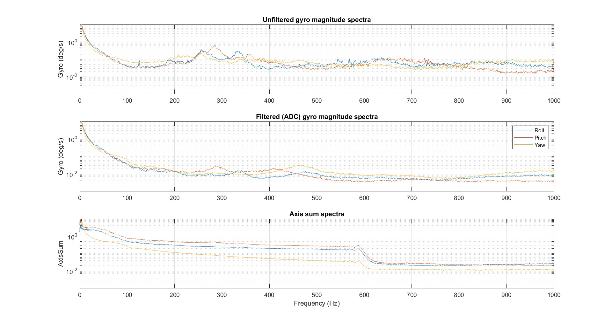

# Gyro Spectra

## Filter settings

Filters in flight controllers are essential for reducing sensor noise and providing the PID controller with a clean signal. Different filters serve different purposes: some remove unwanted frequencies, while others specifically target vibration-related noise during flight. Using the right combination of filters is crucial for achieving stable flight and efficient motor behavior.
One important filter is the low-pass filter, which should act as an anti-aliasing filter. An anti-aliasing filter ensures that very high frequencies do not fold back into the measurable signal during logging. However, it does not remove motor noise seen by the PID controller during flight, because this noise lies well below the anti-aliasing cutoff. Therefore, additional filters are necessary to clean up the gyro signal for flight control.
Recommended filters:

- RPM Filter: Should always be enabled. It uses exact motor RPM values to remove motor harmonics and their multiples very effectively, making the filtering process highly precise.
- Dynamic Notch Filter: Strongly recommended. It automatically adjusts to vibration peaks during flight, which is useful for handling changing vibration patterns.
- Fixed Gyro Notch Filter: Optional but essential for a perfect tune. It is only useful when all three gyro axes show a strong peak at the same frequency, usually indicating a frame or prop resonance.
- D-Term Low-Pass Filter: Should always be active. Since the D-term amplifies high-frequency noise, a cutoff around 80–120 Hz helps keep motors cool and prevents oscillations.

## Spectra Information

The gyro spectra are very important because they show how much noise and vibration the drone produces at different frequencies. This helps you understand which parts of the signal are useful for control and which parts need to be filtered out. By looking at the spectra, you can clearly see the motor harmonics, frame vibrations and other noise peaks that could disturb the PID controller.
When analyzing the spectra, you should pay attention to:

  

- **Resonance peaks:** If all three gyro axes show a peak at the same frequency, it often means a frame or propeller resonance. In this case, a fixed notch filter can be very helpful.
- **Noise floor:** A high noise floor means a lot of general vibration or bad filtering. A clean noise floor indicates that the filters are working well.
- **Axis differences:** If one axis is much noisier than the others, it may indicate mechanical issues like a bent motor shaft, unbalanced prop, or loose screws.

By combining the spectra with the filter settings, you can choose filters that keep the noise low while still allowing fast and responsive control behavior.

## Axis Sum Spectra

As described in the [flight overview documentation](./Flight_Overview.md), AxisSum represents the total output of the rate PID controller for each axis (roll, pitch and yaw), combining all active control terms (P, I, D and feedforward, if enabled). Here, in the frequency domain, the AxisSum spectra show at which frequencies the controller is working hardest.

In the spectra, low amplitudes indicate the drone is tracking the setpoint with minimal correction, while higher amplitudes mean the controller is applying more effort to compensate for disturbances, tracking errors, or aggressive inputs. Spikes or elevated noise at specific frequencies often correspond to mechanical resonances, motor harmonics, or persistent vibrations. A generally high noise floor or persistent high levels can indicate overly aggressive gains, insufficient filtering, or mechanical issues.

For a well-tuned drone, AxisSum amplitudes should remain low across most frequencies, except near the motor bands where more control output is naturally needed. Analyzing the AxisSum spectra helps you quickly spot if the controller is being overworked at certain frequencies, so you can target tuning, filtering, or mechanical improvements more effectively.
