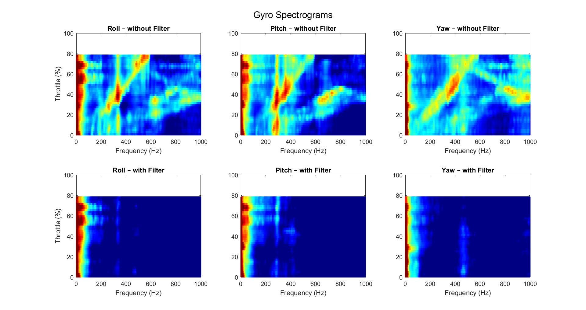

# Gyro Spectrogram

Spectrograms provide a powerful visualization of how gyro noise changes across both frequency and throttle. They display frequency on the horizontal axis, throttle percentage on the vertical axis and use color intensity to show the strength of vibrations at each point.  This three-dimensional view makes it easy to identify noise patterns, understand how they evolve with motor speed and evaluate filter effectiveness. 

By comparing unfiltered and filtered spectrograms, you can see exactly which frequencies are problematic and how well your filter configuration addresses them. This makes spectrograms one of the most valuable tools for optimizing filter settings and achieving clean, responsive flight performance.

## Understanding Spectrogram Patterns

  

The color shows the signal intensity:
- **Red** indicates high noise levels
- **Dark blue** indicates low noise levels

### Vertical Lines (Resonances of the frame)
Vertical lines that remain at a constant frequency across all throttle levels typically indicate **frame resonances** or vibrations from loose components. These are mechanical issues where the frame, arms, or mounting hardware vibrate at their natural resonant frequency regardless of motor speed.

**What to do:** Consider using a **static gyro notch filter** at the resonant frequency, or address the mechanical issue by tightening screws, adding dampening material, or reinforcing weak points in the frame.

### Diagonal Lines Moving Upward (Motor Harmonics)
Smooth diagonal lines that move upward with increasing throttle represent **motor frequencies and their harmonics**. As throttle increases, motor RPM increases, causing these noise bands to shift to higher frequencies. Multiple parallel diagonal lines show the fundamental motor frequency and its multiples (2x, 3x, 4x, etc.).

**What to do:** The most effective way to filter this, is with the **RPM filter**. To enable this you need bidirectional DSHOT. The RPM filter uses real time RPM data to track motor frequencies and removes them precisely across the entire throttle range.

### Diagonal Lines Moving Downward (Aliasing)
When sampling a signal that contains frequencies higher than half your sampling rate, aliasing can occur. This causes high-frequency content to appear as lower frequencies, corrupting the measurement data.

**What to do:** Use a static lowpass filter. The cutoff frequency should not be higher than half the sampling frequency. 
For example, if your logging frequency is 2 kHz, the cutoff frequency should be less than 1 kHz. To be safe, set it, for example, to 800 Hz.

After filtering, you want to see mostly dark blue colors except at very low frequencies where real control inputs occur. (See filtered plots in the figure above)

## Why Spectrograms Are Essential

Spectrograms provide a complete overview of how the drone behaves across different frequencies and throttle levels. This ensures that filters are applied where needed without over-filtering the system, leading to:

- Smoother flight with reduced oscillations
- Cooler motors and improved efficiency
- More responsive control without noise-induced instability
- Longer motor and component lifespan

## Sources

[Betaflight Wiki - Power and Spectral Density charts](https://www.betaflight.com/docs/wiki/guides/current/BBE-Power-Spectral-Density-charts)