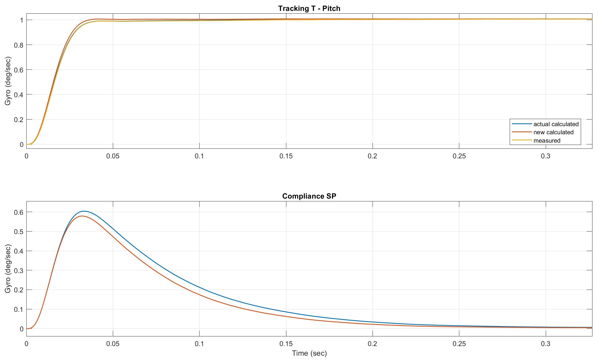

# Step Response

This plot gives you a clear picture of how the drone’s control system handles sudden changes, whether it’s a quick step in the setpoint (commanded value) or an unexpected disturbance. By looking at how the system reacts, you can see how quickly and accurately the quadcopter responds to commands. The shape and timing of the step response curve provide valuable feedback on your PID tuning and help you judge whether the controller is striking the right balance between speed, stability and precision.

  

## Tracking T - Interpretation & Tuning Relevance

The tracking response shows how quickly and accurately the drone follows the step command. A good tracking curve rises steeply, reaches the target without excessive overshoot and then holds stable.

**What matters for tuning**

- **Rise time:** If too slow ⟶ increase P or I
- **Overshoot:** Overshoot too high ⟶ reduce P or increase D
- **Steady-state error:** If the response settles below the target ⟶ increase I
- **Oscillation or ringing:** Persistent oscillations ⟶ lower P or increase D
- **Settling time:** If the system takes too long to stabilize ⟶ increase D or fine-tune P
- **Noise amplification:** Too much jitter in the response ⟶ reduce D or add filtering to gyro/D-term

To build intuition for how P, I and D values affect system behavior, consider checking out this [PID Controller Simulator](https://www.luisllamas.es/en/pid-controller-simulator/) as a guidance tool too.

If the measured and actual calculated values do not match, check if `do_compensate_iterm` is activated in main.

## Compliance SP – Interpretation & Tuning Relevance

The compliance response shows how effectively your flight controller can handle sudden external disturbances like wind gusts or propwash. Ideally, you’ll see a short, single bump in the response that quickly settles back to zero.

**What matters for tuning**

- **Strong, quick recovery:** If the curve rises and then settles right away, the controller is doing a good job of rejecting disturbances.
- **High peak:** If the peak is too pronounced, the controller may not be pushing back hard enough. Try increasing D gain, or, if that’s not enough, add some P.
- **Doesn’t return to baseline:** If the response stays offset instead of coming back to the original value, consider increasing I gain to help the controller finish the correction.
- **Noisy or twitchy response:** If the plot looks busy or irregular, D might be set too high or you could benefit from additional filtering.

Aim for a compliance response that produces a single, smooth bump and then settles—this indicates your quad can shrug off disturbances and maintain steady flight.

