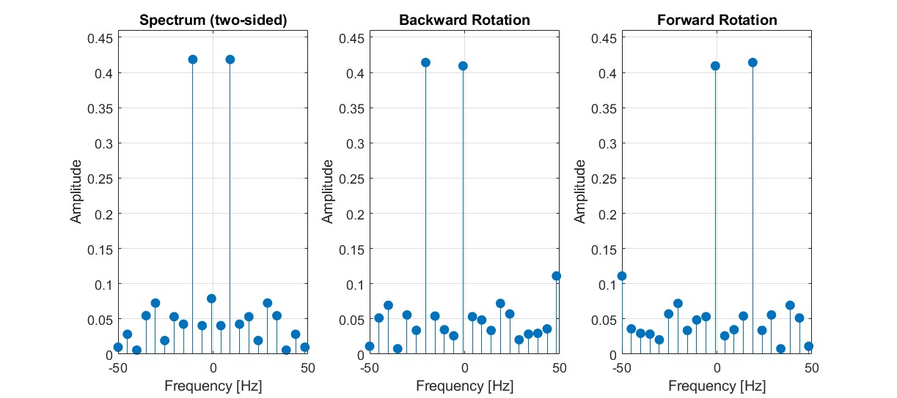

# Function `apply_rotfiltfilt`

Signals are often contaminated with noise and unwanted high-frequency components that can obscure the essential information they carry. The `apply_rotfiltfilt` function is designed to address this challenge by effectively filtering such signals while preserving their phase integrity [4][5].

As an example, we consider a sine wave corrupted by noise which we will filter with the `apply_rotfiltfilt`.

  

## Frequency Shifting to Baseband

`apply_rotfiltfilt` uses a mathematical technique that allows us to shift the frequency content of a signal to a baseband (around 0 Hz), apply a low-pass filter and then shift it back to its original frequency range. This process effectively removes high-frequency noise while maintaining the phase characteristics of the original signal [1].

First, we follow the principles of the Fourier shift theorem [1].

$$e^{i2\pi \xi_0 t}\cdot f(t) \xleftrightarrow{\mathcal{F}} \hat{f}(\xi - \xi_0)$$

In our case, however, the frequency shift $\xi_0$ is **not constant** and it changes **over time**. This comes from the fact that we are dealing with a chirp signal, whose frequency varies continuously. This means that the instantaneous frequency of the chirp is dynamically shifted to the baseband at every moment. So we have to use a **time-dependent phasor** $p(t) = e^{i\,\text{sinarg}(t)}$, where `sinarg` represents the **phase progression** of the carrier signal. More on this can be found in the [Chirp Signal](../Sinarg/Chirp.md) documentation [2].

By multiplying the input signal $x(t)$ with this phasor $p(t)$ or its complex conjugate $p^*(t)$, the signal shifts the negative and positive frequency components towards 0 Hz [1].

$$y_R(t) = x(t) \cdot p(t), \qquad y_Q(t) = x(t) \cdot p^*(t)$$

As you can see in the following spectrum plot, after this rotation step, the signal's frequency content is now centered around 0 Hz, making it suitable for low-pass filtering.

  

## Baseband Filtering and Inverse Rotation

Once the signal resides in the baseband, a **zero-phase low-pass filter** can be applied without distorting its timing or phase relationships [4][5]. First we have to create a suitable low-pass filter which lies within a small frequency range around 0 Hz. The newly created filter is then applied to both rotated signals $y_R(t)$ and $y_Q(t)$ using the `filtfilt` function in MATLAB, which performs forward and backward filtering to ensure zero-phase distortion [3].

As you can see in the following spectrum plot, after filtering, the high-frequency noise components have been effectively removed, leaving a clean signal centered around 0 Hz.

  

## Inverse Frequency Shift

After the filtering in the baseband, the signal is **rotated back** to its original frequency range [1]. This is done by multiplying the filtered signals $y_R(t)$ and $y_Q(t)$ with their respective inverse phasors and then combining them back into a **real signal**:

$$x_f(t)=\mathrm{Re}\{(\tfrac12\ \cdot(y_R(t)p^*(t)+y_Q(t)p(t)))\}$$

The result is a filtered version of the original signal $x(t)$, with high-frequency noise effectively removed while preserving the phase characteristics [3].

  

## References

[1] M. H. Hayes, Statistical Digital Signal Processing and Modeling, 1st ed., John Wiley & Sons, New York, 1996, p. 14.

[2] MathWorks, “chirp”, MATLAB Signal Processing Toolbox Documentation.
Available: https://ch.mathworks.com/help/signal/ref/chirp.html
Accessed: 16 Dec. 2025.

[3] M. H. Hayes, Statistical Digital Signal Processing and Modeling, 1st ed., John Wiley & Sons, New York, 1996, pp. 330–340. 

