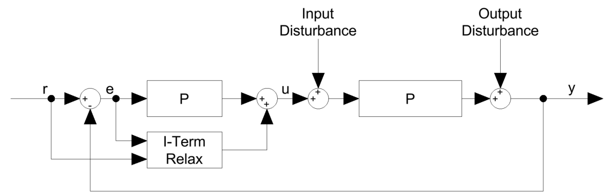

## Compensation of the I-Term

The integral term of a PID controller is used to compensate for steady-state errors by integrating the control error over time [1]. In flight control systems, this allows constant disturbances such as motor imbalances, sensor offsets, or aerodynamic effects to be counteracted. Under steady operating conditions, the I-term converges to a value that compensates these disturbances and supports accurate tracking of the commanded motion.

During fast stick movements or aggressive maneuvers, however, the control error can change rapidly and reach large magnitudes over short time intervals. If the integral term is allowed to integrate this transient error without limitation, excessive accumulation can occur. In this case, the accumulated I-term no longer represents a disturbance compensation but instead opposes the intended pilot input.

When the maneuver ends and the setpoint returns to a steady value, the stored integral action remains present in the controller output. This can lead to overshoot, bounce-back effects, oscillatory behavior, or a slow settling of the system. These effects are particularly noticeable in highly dynamic flight regimes [2].

To reduce these effects, Betaflight uses a feature referred to as **I-Term Relax** [3]. This mechanism temporarily limits the integration of the I-term when rapid changes in the system are detected. Depending on the selected configuration, these changes are identified either from the control setpoint or from the measured gyroscope signal. When the detected change exceeds a defined threshold, the I-term integration is reduced or paused.

This approach allows the controller to respond quickly to fast pilot inputs while preventing excessive buildup of the integral term. During slower movements and steady operation, normal integration of the I-term is gradually restored. As a result, I-Term Relax improves flight behavior by reducing overshoot and bounce-back effects while maintaining good disturbance rejection in steady-state conditions.

For analysis and controller tuning, the effect of I-Term Relax must be considered, as it introduces a condition-dependent modification of the controller behavior. Since the integration of the I-term is adjusted dynamically, the effective controller differs from an ideal linear PI controller, particularly in transient operating regions.

  
   
  <em>Figure: Control loop with I-Term Relax</em>

 
The measured controller transfer function is therefore compared with an analytically derived PI controller transfer function. The effect of the I-Term Relax algorithm, as well as other unmodeled dynamics, is implicitly included in the measurement-based result. To quantify this deviation, a frequency-dependent compensation factor is defined as the ratio between the measured PI controller transfer function `C_PI(ω)` and its analytical counterpart `C_PI,ana(ω)`:

$$C_{PI,com}(ω) = C_{PI}(ω) / C_{PI,ana}(ω)$$

This compensation factor represents the combined influence of dynamics that are not explicitly modeled, including the impact of I-Term Relax. The factor is then applied to both the original analytical PI controller and the newly designed PI controller, resulting in the compensated controller transfer functions:

$$C_{PI,ana,new}(ω) = C_{PI,ana}(ω) · C_{PI,com}(ω)$$

---
## References

[1] K. Stadler, Control Theory I (Regelungstechnik I), ZHAW, Rev. 7.13, 2025,
Sec. 5.2.2, pp. 79–81.

[2] K. Stadler, Control Theory I (Regelungstechnik I), ZHAW, Rev. 7.13, 2025,
Sec. 6.3.1–6.3.2, pp. 111–114.

[3] Betaflight Development Team, I-Term Relax, Betaflight Wiki.
Available: https://github.com/betaflight/betaflight/wiki/I-Term-Relax

