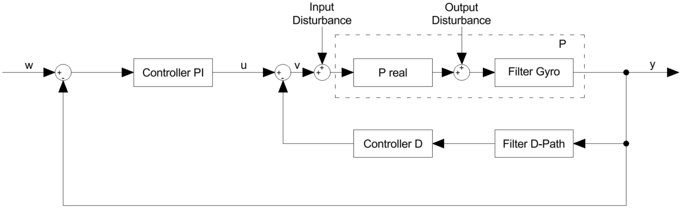

# Determination of the Transfer Functions

For the calculation of the transfer functions, corresponding input and output signals were selected from the measurement data. To reduce the influence of noise and disturbances, the functions [`apply_rotfiltfilt`](./ApplyRotRotfilt.md) and [`estimate_frequency_response`](./estimate_frequency_response.md) were used. (More information in [Function apply_rotfiltfilt](./ApplyRotfiltfilt.md) and [Function estimate_frequency_response](./estimate_frequency_response.md))
The first function shifts the signal to the baseband and applies zero-phase filtering to suppress unwanted components, while the second performs the frequency response estimation using the Welch method with amplitude-correct scaling [1]. 

Additionally, care was taken to use as few signals as possible from the closed loop, since noise in those signals is fed back and can therefore be amplified. With these measures, a robust and noise-resistant estimation of the transfer functions could be achieved.

## Measured Transfer Paths

In principle, the transfer function $P(\omega)$ can be determined by measuring the input and output signals and calculating the spectrum using the **Fast Fourier Transform (FFT)**:
$G_{yv}(j\omega) = P(\omega) = \frac{Y(\omega)}{U(\omega)}$

However, the resulting measurement is affected by disturbances that are present throughout the closed loop. For this reason, measurements are usually taken **outside the closed loop** to minimize the influence of noise on the signals.

The individual transfer functions are related through the closed-loop relationships:

$$G_{yu}(\omega)= \frac{P(\omega)}{1 + P(\omega)C_{D}(\omega)G_{fD}}$$
$$G_{yw}(\omega) = T(\omega) = \frac{G_{yu}(\omega)\,C_{PI}(\omega)}{1 + G_{yu}(\omega)\,C_{PI}(\omega)}$$
$$G_{uw}(\omega) = \frac{C_{PI}(\omega)}{1 + G_{yu}(\omega)\,C_{PI}(\omega)}$$

$$\Rightarrow P(\omega) = \frac{T(\omega)}{G_{wu}(\omega)}$$

These relationships make it possible to **reconstruct the plant transfer function $P(j\omega)$ from closed-loop measurement data** without opening the control loop during the experiment. [2]

  

## Compensation of Gyro Path Filters

Since the measured signal $y(t)$ includes the effect of all filters in the gyro signal path (e.g., DLPF, notch, or software low-pass), the resulting $P(j\omega)$ represents the **filtered plant**:

$P(\omega) = P_\text{real}(\omega) \cdot G_f(\omega)$ where $G_f(\omega)$ denotes the gyro filter dynamics.

To obtain the **true plant**, the known filter model $G_{f}(\omega)$ is divided out:
$P_\text{real}(\omega) = \frac{P(\omega)}{G_{f}(\omega)}.$

This step restores the unfiltered system dynamics of the motor and frame, while maintaining consistency with the measured closed-loop responses. [2]

## Coherence and Measurement Quality

The coherence is derived from the **auto** and **cross power spectra** of the input $U(f)$ and output $Y(f)$.  
They are defined as

$$S_{UU}(\omega) = U(\omega) \cdot \overline{U(\omega)}$$
$$S_{YU}(\omega) = Y(\omega) \cdot \overline{U(\omega)}$$
$$S_{YY}(\omega) = Y(\omega) \cdot \overline{Y(\omega)}$$

Using these spectra, the **magnitude-squared coherence** is obtained as $\gamma^2(f) = \frac{|S_{YU}(f)|^2}{S_{YY}(f)\,S_{UU}(f)}$.

A high coherence $\gamma^2(f) \approx 1$ indicates a strong linear relationship between the input and output signals,  
confirming that the frequency response estimation is reliable. If the coherence is close to zero, it indicates a very weak or non-existent relationship between the signals. Therefore, it serves as an indicator of an **inaccurate or noise-dominated frequency response estimate** at that frequency. [3]

## References

[1] M. H. Hayes, Statistical Digital Signal Processing and Modeling, 1st ed., John Wiley & Sons, New York, 1996, 12–14, 330–340.

[2] H. Lutz and W. Wendt, Taschenbuch der Regelungstechnik, 6th ed., Springer Vieweg, Berlin, Heidelberg, pp. 183–186.

[3] R. Pintelon and J. Schoukens, System Identification: A Frequency Domain Approach, 2nd ed., IEEE Press, 2012, pp. 53–54.
