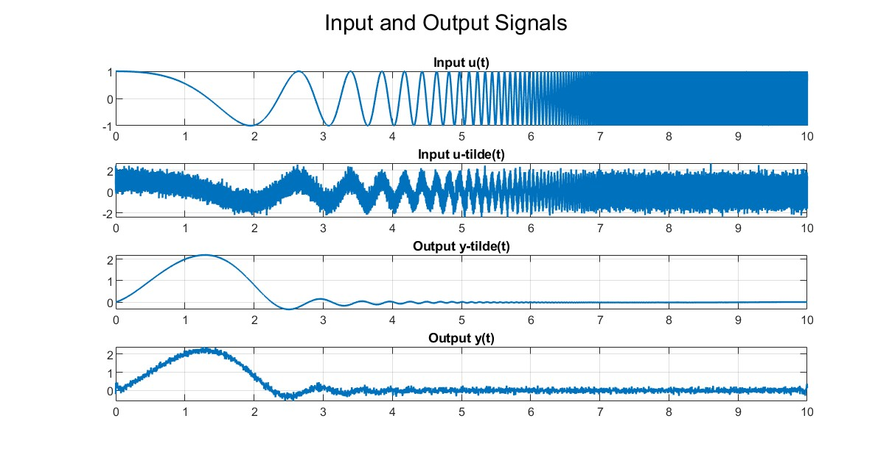
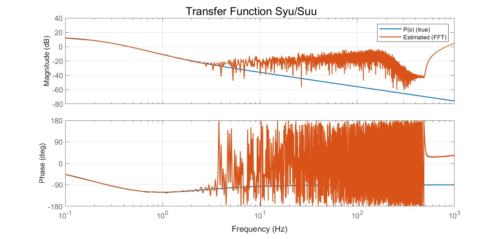

# Estimate Frequency Response

The `estimate_frequency_response` function estimates the **frequency response** and **coherence** between a measured input and output signal using the **Welch method** for spectral averaging. It returns an amplitude-calibrated, single-sided frequency response with correct phase and energy scaling.

As an example, consider a system excited by a random or chirp signal, where both input and output are measured to identify its linear dynamics.

  

## Spectral Estimation and Theoretical Basis

### Derivation of the Frequency Response Formula

In the frequency domain, the relation between input and output of a linear time-invariant (LTI) system can be expressed as

$$G(\omega) = \frac{Y(\omega)}{U(\omega)},$$

where $U(\omega)$ and $Y(\omega)$ are the Fourier transforms of the input $u(t)$ and output $y(t)$. This ratio describes how each frequency component of the input is scaled and phase-shifted by the system.

In practice, however, direct division of $Y(\omega)$ and $U(\omega)$ is sensitive to noise.  
To obtain a more reliable estimate, we use averaged spectral quantities [1][2]:

$$S_{yu}(\omega) = E\{Y(\omega)U^*(\omega)\}$$
$$S_{uu}(\omega) = E\{|U(\omega)|^2\}$$

which leads to the practical and statistically robust estimator

$$G(\omega) = \frac{S_{yu}(\omega)}{S_{uu}(\omega)}.$$

This formulation provides a consistent estimate of the system’s amplitude and phase response across all frequencies [1].

  

## The Welch Method for Averaging

The function implements the **Welch averaging method** [1], which provides a smoother and statistically robust estimate by dividing the data into overlapping, windowed segments.

1. **Segmentation:**  
   The signals are divided into short overlapping sections of length $N_\text{est}$ with overlap.

2. **Windowing:**  
   Each segment is multiplied by a window (for example Hann) to reduce spectral leakage.

3. **FFT and normalization:**  
   Each windowed segment is transformed using the FFT and normalized by $W = \sum w(n)/2$, ensuring correct amplitude calibration [1].

4. **Power spectra formation:**  
   For each segment:
   
   $$S_{uu,k}(\omega) = U_k(\omega)U_k^*(\omega)$$

   $$S_{yu,k}(\omega) = Y_k(j\omega)U_k^*(\omega)$$

   $$S_{yy,k}(\omega) = Y_k(\omega)Y_k^*(\omega)$$
   
   The spectra are then converted to **one-sided** form by doubling all interior bins and dividing the DC and Nyquist bins by 4 [1].

 **Averaging:**  
   The spectra from all segments are averaged to yield $S_{uu}, S_{yu}, S_{yy}$.

  

## Regularization and Robustness

To avoid division by near-zero values of $S_{uu}(\omega)$, a small positive constant `delta` is added:

$$G(\omega) = \frac{S_{yu}(\omega)}{S_{uu}(\omega) + \delta}$$

This **regularized spectral inversion** improves numerical stability [2].

## References

[1] R. Pintelon and J. Schoukens, System Identification: A Frequency Domain Approach, 2nd ed., IEEE Press, 2012, pp. 52–55.
    
[2] M. H. Hayes, Statistical Digital Signal Processing and Modeling, 1st ed., John Wiley & Sons, New York, 1996, pp. 395-415.

