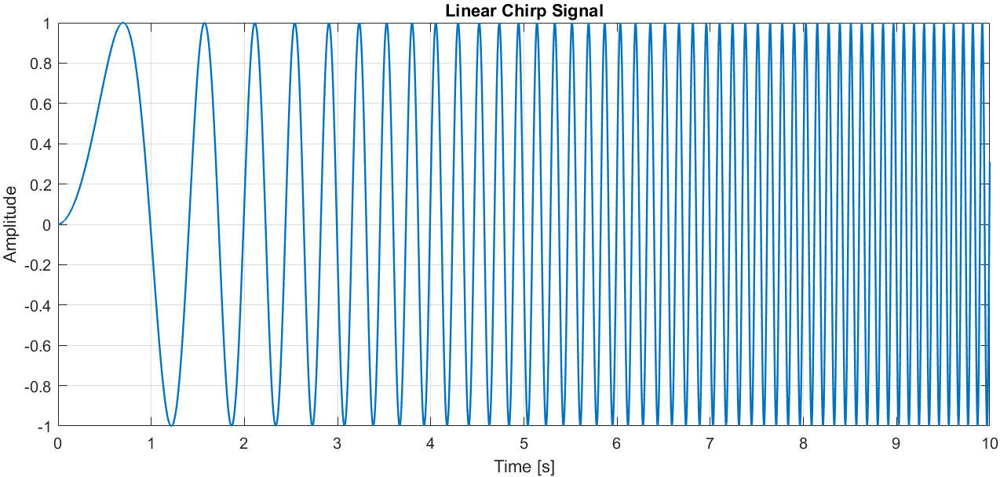
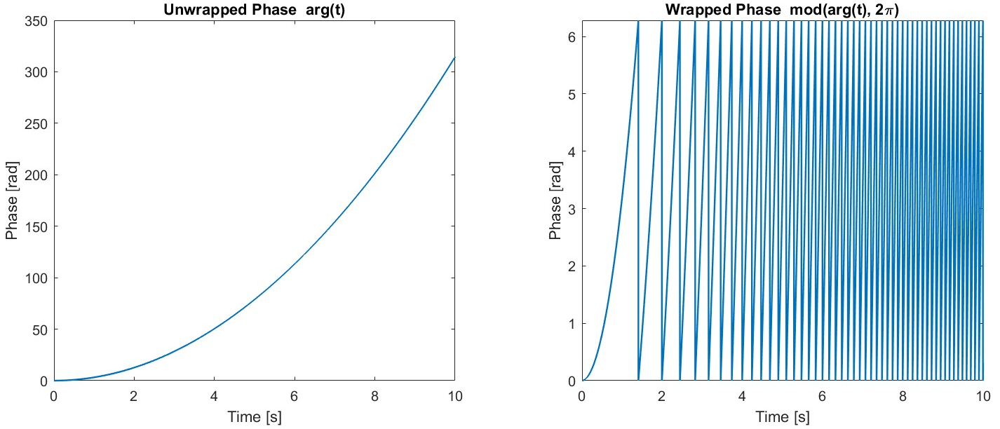
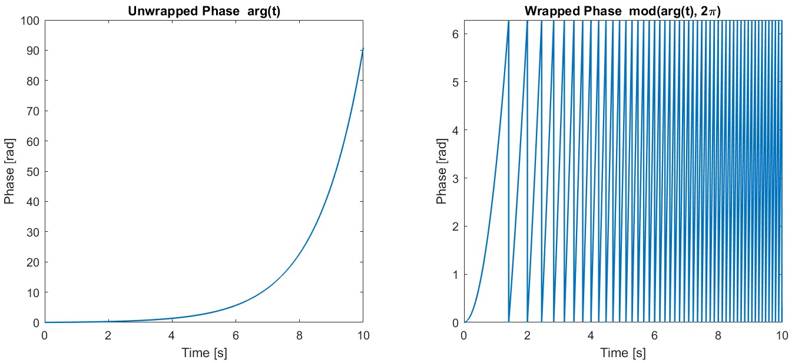

# Chirp-Signal and `sinarg`

A **chirp signal** is a sinusoidal signal whose **frequency varies continuously over time**. It is widely used in **system identification** to excite a broad range of frequencies in a single measurement, making it possible to estimate the frequency response $G(\omega)$ efficiently [1].


## Mathematical Definition

The instantaneous value of the chirp is defined as
$x(t) = \sin(\text{arg}(t)),$ where the phase argument $\text{arg}(t) = 2\pi \int_0^t f(\tau)\,d\tau$ represents the **instantaneous phase** of the signal. The derivative of this phase yields the **instantaneous frequency** $f(t) = \frac{1}{2\pi}\frac{d(\text{arg}(t))}{dt}$. So `sinarg` expresses a sinusoidal signal with a continuously varying frequency.

<p align="center">
  
</p>

In practical implementations such as **Betaflight**, the phase $\text{arg}(t)$ is wrapped using the modulo operation 
$\text{arg}(t) \bmod 2\pi$, so that it resets to 0 whenever a full $2\pi$ rotation is reached. This keeps the numerical values bounded and results in the **sawtooth-shaped** `sinarg` signal often seen in practice [1].


## Common Frequency Profiles

- **Linear chirp:**
  The frequency increases linearly over time:
  
  $k = \frac{f_1-f_0}{T} \qquad
  f(t) = f_0 + k t \qquad
  \text{arg}(t) = 2\pi\left(f_0 t + \tfrac{1}{2}k t^2\right)$

  <p align="center">
  
  </p>

- **Exponential chirp (as used in Betaflight):**  
  The frequency grows exponentially from the starting frequency $f_0$ to the ending frequency $f_1$ in the time $T$:  
  
  $f(t) = f_0 \left(\frac{f_1}{f_0}\right)^{t/T} \quad \text{arg}(t) = \frac{2\pi T f_0}{\ln(f_1/f_0)}\left[\left(\frac{f_1}{f_0}\right)^{t/T}-1\right]$

  These functions define the **phase trajectory** `arg(t)` used in simulations and in the `apply_rotfiltfilt` method for time-dependent frequency shifting of chirp signals [1].

 <p align="center">
  
  </p>


## Purpose and Application

In frequency-domain system identification, chirp signals provide an **energy-efficient broadband excitation**.  
The measured input and output signals can be used to estimate the system's transfer function over a continuous frequency range. Compared to step or random excitation, chirps allow faster and more phase-consistent measurements of linear system dynamics [1].


## Lag Filter for Chirp Input Shaping

Prior to injection into the control loop, the chirp signal is conditioned using a filter to compensate for the differentiating behavior of the controller effort at low frequencies. This differentiating characteristic leads to an increasing gain toward lower frequencies, which would otherwise result in excessive motor excitation at the beginning of the chirp sweep. Such behavior may cause actuator saturation and thereby degrade the quality of the system identification data.

To mitigate this effect, the filter attenuates low-to-mid frequency components of the chirp signal before injection. As a result, the combined response of the filter and controller produces a more uniform excitation level across the frequency range of interest.

The filter is configured with a pole at **3 Hz** and a zero at **30 Hz**, yielding the following transfer function:

```math
H(s) = \frac{1 + s/\omega_z}{1 + s/\omega_p}
```

where $\omega_z = 2\pi \cdot 30\ \text{rad/s}$ represents the zero frequency and
$\omega_p = 2\pi \cdot 3\ \text{rad/s}$ represents the pole frequency.

The pole introduces the lag characteristic by reducing the magnitude for frequencies above its cutoff frequency. Conversely, the zero limits this attenuation by introducing magnitude amplification above its own cutoff frequency. However, since the pole frequency is lower than the zero frequency, the pole’s contribution dominates over the primary control bandwidth, resulting in an overall lag filter behavior.

It is important to note that in the Betaflight implementation, the pole frequency \(\omega_p\) must not be set higher than the zero frequency \(\omega_z\). Otherwise, the filter would behave as a lead filter, amplifying high-frequency components and potentially causing excessive motor excitation or hardware damage.

<p align="center">
  
</p>


## References

[1] MathWorks, “chirp,” MATLAB Signal Processing Toolbox Documentation.  
    Available: https://ch.mathworks.com/help/signal/ref/chirp.html
